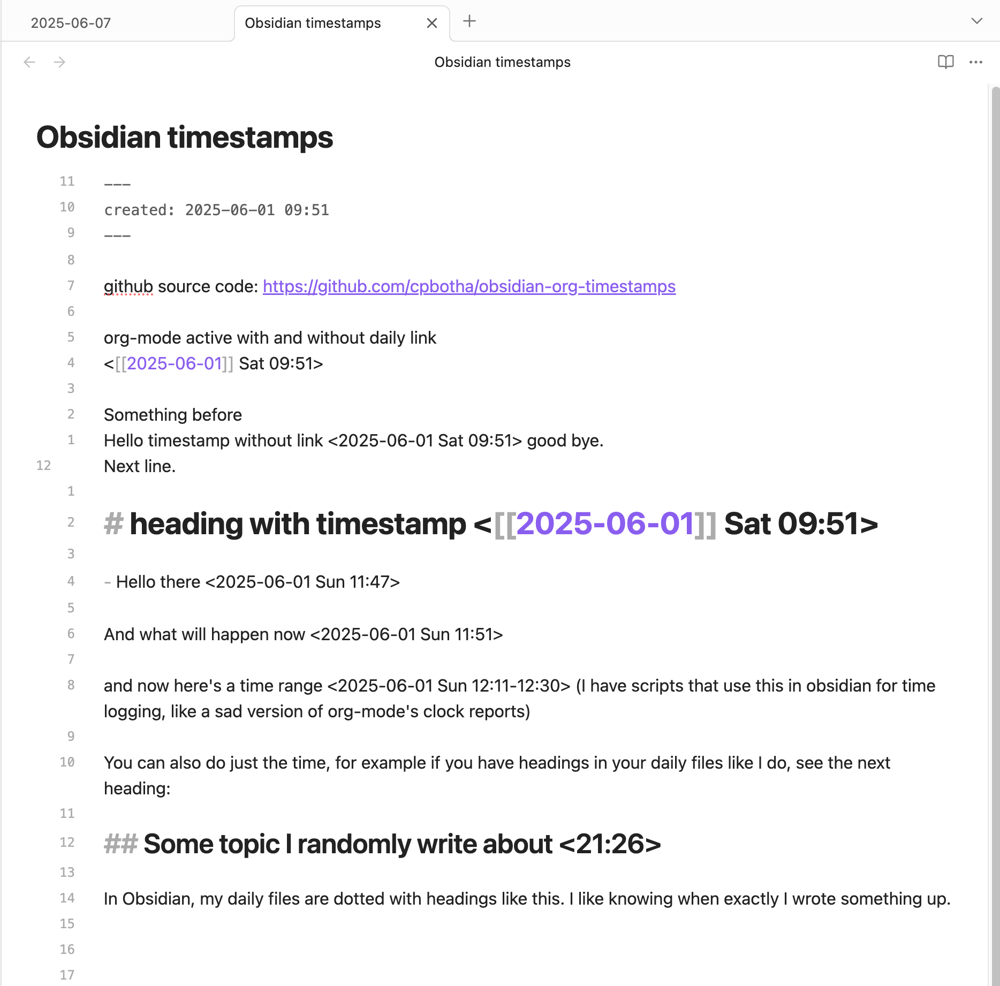
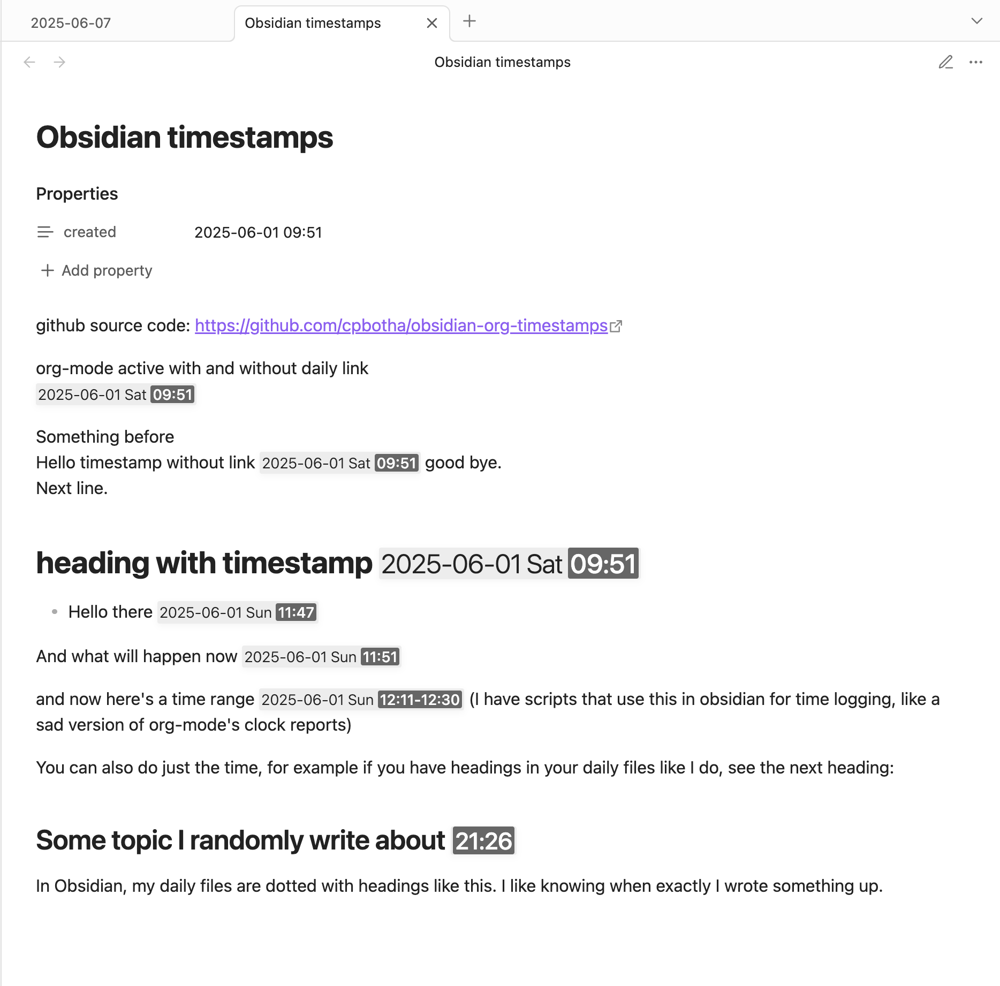

# Obsidian plugin: Org timestamps

Render pretty org-mode(rn) timestamps in Obsidian

## Features

org-mode style timestamps are nicely rendered, see example below

Markdown source             |  Rendered with org-timestamps
:-------------------------:|:-------------------------:
 | 

## Quickstart

This plugin has not yet been published as a community plugin. When it does, you'll be able to install from there. Until then, see the next section on how to install manually.

<!-- [Install plugin via community plugins](https://obsidian.md/plugins?id=org-timestamps) -->

## Manually installing the plugin

Download `main.js`, `manifest.json` from [latest release on github](https://github.com/cpbotha/obsidian-org-timestamps/releases/latest) to your vault `VaultFolder/.obsidian/plugins/org-timestamps/`.

## Dev quickstart

- Clone this repo.
- Make sure your NodeJS is at least v16 (`node --version`).
- `corepack enable`
- `yarn` to install dependencies (we use Yarn PnP)
- `yarn run dev` to start compilation in watch mode.

## Dev publish new version

See [Create a new release](https://docs.obsidian.md/Plugins/Releasing/Submit+your+plugin#Step+2+Create+a+release)

- Update [manifest.json](./manifest.json) and [CHANGELOG.md](./manifest.json).
- `yarn run build`

- Create [new github release](https://github.com/cpbotha/obsidian-ai-chat-as-md/releases) and tag with e.g. 1.1.5
  - Upload the freshly built `main.js` and updated `manifest.json` as binary attachments.
